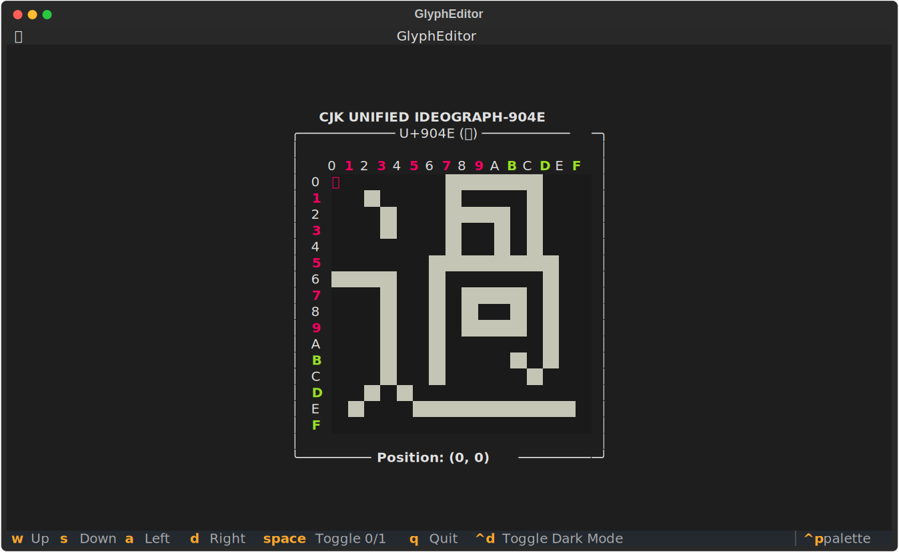

# 编辑器

本项目还提供了一些CLI程序，可直接在终端中修改字形。编辑的结果可以在代码中继续使用，不必中途易辙。

这些CLI程序使用跨平台的框架[Textual](https://textual.textualize.io/)编写，对终端的要求不高。不过，仍然建议使用比较现代的终端来运行它们。

## `GlyphEditor`

`GlyphEditor`可以用来编辑字形，需要传入`Glyph`对象。

下面以字符“過”（U+904E）为例：

``` python
>>> from unicode_utils import Glyph, GlyphEditor
>>> glyph = Glyph("904E")
>>> glyph.load_hex("01F8210811E81128012803FCF20412F4129412F4120412141208280047FE0000")
>>> GlyphEditor(glyph).run()
```

此时，终端的显示应当类似于下图：




### 编辑模式

此编辑器可以使用键盘或鼠标操作。

#### 键盘

| 按键 | 功能 |
| --- | --- |
| ++t++ / `↑` / `↓` / `←` / `→` | 移动光标 |

## `GlyphReplacer`

`GlyphReplacer`可以用来交互式替换字形，需要传入`Glyph`对象和查找、替换所用的图案。
