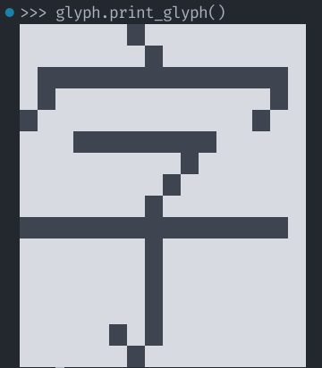
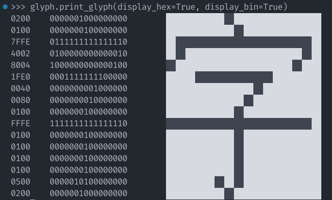
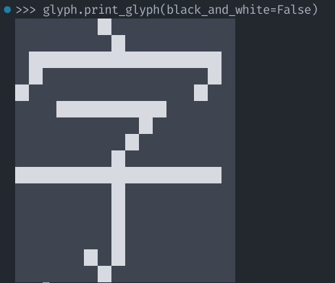

# 字形

## `Glyph`类

`Glyph`类用于存储单个字形数据，包括字形的Unicode编码（及名称）、字形的尺寸、字形的位图数据等。

### 实例化

实例化`Glyph`类时，需要指定字形的Unicode编码。

``` python
>>> from unifont_utils import Glyph
>>> glyph = Glyph("5B57")
>>> glyph = Glyph("5b57")
>>> glyph = Glyph(0x5B57)
>>> glyph = Glyph(23383)
```

!!! note
    指定的Unicode编码必须为`str`（大小写不限，不包括“U+”）或`int`类型，否则会抛出`TypeError`异常。编码也不能超过`0x10FFFF`（即PUA-B区域的最大编码），否则会抛出`ValueError`异常。

## 从`.hex`格式字符串中加载数据

### `.hex`格式字符串

之前我们实例化的`Glyph`对象都是从Unicode编码直接创建的，没有加载任何字形数据。

我们可以直接从Unifont使用的`.hex`格式字符串中加载字形数据。

`.hex`格式字符串是指以十六进制字符串表示的字形数据，从二进制转换而来，便于存储和传输。例如，拉丁字母“A”（U+0041）的`.hex`格式字符串为：

``` text
0041:0000000018242442427E424242420000
```

如果一一对应，那么它表示的数据就是下面这样的：

``` text
00 00000000 --------
00 00000000 --------
00 00000000 --------
00 00000000 --------
18 00011000 ---██---
24 00100100 --█--█--
24 00100100 --█--█--
42 01000010 -█----█-
42 01000010 -█----█-
7E 01111110 -██████-
42 01000010 -█----█-
42 01000010 -█----█-
42 01000010 -█----█-
42 01000010 -█----█-
00 00000000 --------
00 00000000 --------
```

### 加载字形数据

如果你已经实例化了一个`Glyph`对象，可以用`load_hex`方法从`.hex`格式字符串中加载字形数据。

``` python
>>> glyph = Glyph("5B57")
>>> hex_string = "020001007FFE400280041FE0004000800100FFFE010001000100010005000200"
>>> glyph.load_hex(hex_string)
```

!!! note
    指定的`.hex`格式字符串必须为`str`类型，否则会抛出`TypeError`异常。并且，`.hex`格式字符串的长度必须为32或64个字符，不能包含0-9、A-F、a-f以外的字符，否则会抛出`ValueError`异常。

可以使用`init_from_hex`方法，在实例化`Glyph`对象的同时直接加载字形数据。

``` python
>>> glyph = Glyph.init_from_hex("5B57", hex_string)
```

## 从图片中加载数据

由于创作字体的过程依托于直接修改图片，因此出于效率考虑，`Glyph`类也提供了从图片中加载字形数据的方法。

提供的路径可以是`Path`对象，也可以是`str`类型的文件路径，否则会抛出`TypeError`异常。

``` python
>>> glyph.load_img("path/to/glyph.png")
```

``` python
>>> path = Path("path/to/glyph.png")
>>> glyph.load_img(path)
```

可以使用`init_from_img`方法，在实例化`Glyph`对象的同时直接加载字形数据。

``` python
>>> glyph = Glyph.init_from_img("5B57", "path/to/glyph.png")
```

GNU官方的位图配色方案是“**白色为`0`，黑色为`1`**”。如果要使用“**透明为`0`，白色为`1`**”的配色方案（如Minecraft），请将`black_and_white`参数设为`False`。

``` python
>>> glyph.load_img("path/to/glyph.png", black_and_white=False)
```

## 获取信息

可以使用`Glyph`类的一些属性查看字形的相关信息。提到的部分“属性”实际上是特性（Property），这里不做区分。

### 获取对应字符信息

在上述的操作中，`glyph`对象中存储的字形的Unicode编码为`U+5B57`，即“字”。

我们可以用`code_point`属性获取其Unicode编码（以`str`类型存储）：

``` python
>>> print(glyph)
Unifont Glyph (U+5B57)
>>> print(glyph.code_point)
5B57
```

此外，还可以用`character`属性获取对应的字符，用`unicode_name`获取查看其Unicode名称：

``` python
>>> print(glyph.character)
字
>>> print(glyph.unicode_name)
CJK UNIFIED IDEOGRAPH-5B57
```

### 获取字形数据

可以用`hex_str`属性获取字形的`.hex`格式字符串，用`data`属性获取字形的二进制数据。

``` python
>>> print(glyph.hex_str)
020001007FFE400280041FE0004000800100FFFE010001000100010005000200
>>> print(glyph.data)
[0, 0, 0, 0, 0, 0, 1, 0, 0, 0, 0, 0, 0, 0, 0, 0, 0, 0, 0, 0, 0, 0, 0, 1, 0, 0, 0, 0, 0, 0, 0, 0, 0, 1, 1, 1, 1, 1, 1, 1, 1, 1, 1, 1, 1, 1, 1, 0, 0, 1, 0, 0, 0, 0, 0, 0, 0, 0, 0, 0, 0, 0, 1, 0, 1, 0, 0, 0, 0, 0, 0, 0, 0, 0, 0, 0, 0, 1, 0, 0, 0, 0, 0, 1, 1, 1, 1, 1, 1, 1, 1, 0, 0, 0, 0, 0, 0, 0, 0, 0, 0, 0, 0, 0, 0, 1, 0, 0, 0, 0, 0, 0, 0, 0, 0, 0, 0, 0, 0, 0, 1, 0, 0, 0, 0, 0, 0, 0, 0, 0, 0, 0, 0, 0, 0, 1, 0, 0, 0, 0, 0, 0, 0, 0, 1, 1, 1, 1, 1, 1, 1, 1, 1, 1, 1, 1, 1, 1, 1, 0, 0, 0, 0, 0, 0, 0, 0, 1, 0, 0, 0, 0, 0, 0, 0, 0, 0, 0, 0, 0, 0, 0, 0, 1, 0, 0, 0, 0, 0, 0, 0, 0, 0, 0, 0, 0, 0, 0, 0, 1, 0, 0, 0, 0, 0, 0, 0, 0, 0, 0, 0, 0, 0, 0, 0, 1, 0, 0, 0, 0, 0, 0, 0, 0, 0, 0, 0, 0, 0, 1, 0, 1, 0, 0, 0, 0, 0, 0, 0, 0, 0, 0, 0, 0, 0, 0, 1, 0, 0, 0, 0, 0, 0, 0, 0, 0]
```

由于Unifont字形的高度必须为16像素，因此`Glyph`类只存储字形的宽度（8或16像素，以`int`类型存储）。可以用`width`属性获取字形的宽度。

``` python
>>> print(glyph.width)
16
```

### 在控制台中打印字形

可以使用`print_glyph`方法在控制台中直接打印字形，以便在不保存图片的情况下快速查看目前存储的字形。

要使用这一功能，你的终端必须支持[ANSI转义序列](https://zh.wikipedia.org/wiki/ANSI%E8%BD%AC%E4%B9%89%E5%BA%8F%E5%88%97)。请注意，**Windows上的Win32控制台不支持ANSI转义序列**，请使用**支持ANSI转义序列的终端**或**适用于Linux的Windows子系统**（WSL），否则可能无法正常显示字形。

``` python
>>> glyph.print_glyph()
```



`print_glyph`方法还提供显示每一行对应的十六进制和二进制字符串的功能，可以用`display_hex`和`display_bin`参数控制。

``` python
>>> glyph.print_glyph(display_hex=True, display_bin=True)
```



如果你是从图片中加载的字形数据，这里的配色方案也会自动继承加载图片时指定的`black_and_white`参数的值。由于终端不可能像图片那样有“透明”的概念，因此“**透明为`0`，白色为`1`**”的配色方案只能处理为黑底白字。

当然，你也可以手动给`print_glyph`方法指定`black_and_white`参数，以覆盖默认值。传入`True`则显示白底黑字，传入`False`则显示黑底白字。

``` python
>>> glyph.print_glyph(black_and_white=False)
```



## 将字形保存为图片

无论你以何种方式在`Glyph`对象中存储了字形数据，都可以用`save_img`方法将字形保存为图片。

提供的路径可以是`Path`对象，也可以是`str`类型的文件路径，否则会抛出`TypeError`异常。

``` python
>>> glyph.save_img("path/to/save.png")
```

``` python
>>> path = Path("path/to/save.png")
>>> glyph.save_img(path)
```

图片格式可以为PNG或BMP，默认使用PNG格式。如果需要使用BMP格式，请指定`img_format`参数为`BMP`或`bmp`。

``` python
>>> glyph.save_img("path/to/save.bmp", img_format="BMP")
```

如果你是从图片中加载的字形数据，那么`Glyph`对象中会存储当时指定的`black_and_white`参数的值。在保存为图片时，会自动继承这个值来决定以何种形式保存图片——换句话说，配色和加载图片时保持一致。

当然，你也可以手动给`save_img`方法指定`black_and_white`参数，以覆盖默认值。

``` python
>>> glyph.save_img("path/to/save.png", black_and_white=False)
```

!!! warning

    由于`BMP`格式不能保存透明度信息，如果指定的图片格式为`BMP`，图片的透明度信息会被忽略，图片会以白底黑字的形式保存（即`black_and_white`参数会被强制设为`True`）。
