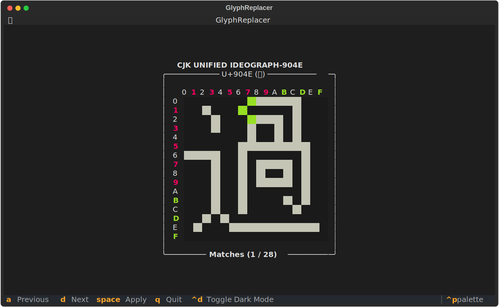
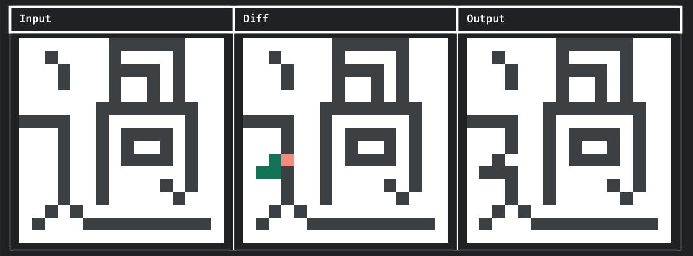

# 替换与差异

## 替换

在处理大量字形时，替换操作很是常见。本项目提供了两种替换方式，可以将字形中的某些图案批量替换。

### 准备图案

在替换字形前，我们需要先准备即将查找、替换的图案。这两种图案使用`SearchPattern`和`ReplacePattern`类的对象表示。

`SearchPattern`对象存储一个列表，其中的元素只能为`0`或`1`（`int`类型），表示该位置的值。

`ReplacePattern`对象存储一个列表，其中的元素只能为`-1`、`0`或`1`（`int`类型），表示该位置的替换情况。`-1`表示保持原样，`0`和`1`则表示替换为此值。

!!! note
    **图案的宽度、高度都不得大于16像素或小于等于2像素**，否则会抛出`ValueError`异常。

#### 直接初始化

可以直接初始化`SearchPattern`和`ReplacePattern`对象。需要传入上述的列表以及图案的宽度、高度。

传入高度是可选的，如果不传入，则会自动计算高度。

``` python
>>> from unicode_utils import SearchPattern, ReplacePattern
>>> p1 = SearchPattern([0, 1, 0, 1, 0, 1], 2)
>>> p2 = ReplacePattern([-1, 1, 1, 0, -1, 1], 2, 3)
```

#### 从图片初始化

也可以使用其他方式绘制图片，再使用`init_from_img`方法从图片初始化这两种图案对象。

``` python
>>> from unicode_utils import SearchPattern, ReplacePattern
>>> p1 = SearchPattern.init_from_img("path/to/p1.png")
>>> p2 = ReplacePattern.init_from_img("path/to/p2.png")
```

`SearchPattern`使用的图片必须为黑、白两色，黑色代表`1`，白色代表`0`。

`ReplacePattern`使用的图片必须为黑、白、透明三色，透明代表`-1`，黑色代表`1`，白色代表`0`。

!!! note
    “透明”的RGBA值必须为`(0, 0, 0, 0)`，即完全透明，且没有任何颜色。黑色、白色的RGBA值必须为`(0, 0, 0, 255)`和`(255, 255, 255, 255)`，完全不透明。如果图片含有不符合这3种情况的像素，则会抛出`ValueError`异常。

### 手动查找图案

可以使用`Glyph`对象的`find_matches`方法查找字形中的图案，并获得匹配的坐标列表。列表中的坐标为匹配图案的左上角坐标。

需要传入`SearchPattern`对象。

``` python
>>> glyph.find_matches(p1)
```

### 手动覆盖图案

可以使用`Glyph`对象的`apply_pattern`方法手动替换字形中某位置的图案。

需要传入覆盖范围左上角的坐标和`ReplacePattern`对象。

``` python
>>> glyph.apply_pattern(2, 3, p2)
```

### 单次查找替换

使用`Glyph`对象的`replace`方法可以实现单次查找替换。这个方法适合较大的、易于匹配且没有重复的图案。

如果匹配的图案出现超过一次，则剩余的部分将被忽略。

``` python
>>> glyph.replace(p1, p2)
```

### 交互式查找替换

`replace`方法只能单次查找替换，并且如果有多个匹配结果，不能指定替换的位置。

遇到这种情况，可以使用`GlyphReplacer`来交互式替换字形。需要传入`Glyph`对象和查找、替换所用的图案。



``` python
>>> from unicode_utils import GlyphReplacer
>>> GlyphReplacer(glyph, p1, p2).run()
```

## 差异

### 获取差异

使用`diff_glyphs`函数可以获取两个字形的差异。传入的字形可以是`Glyph`对象，也可以是`.hex`格式字符串。

传入的两个字形必须有相同的尺寸。

``` python
>>> from unicode_utils import diff_glyphs
>>> diff = diff_glyphs(glyph1, glyph2)
```

函数返回一个列表，列表中的元素为`str`类型，表示对应位置的差异情况。

- `0`：表示两字形该位置都为`0`。
- `1`：表示两字形该位置都为`1`。
- `+`：表示字形1该位置为`0`，字形2该位置为`1`。
- `-`：表示字形1该位置为`1`，字形2该位置为`0`。

### 打印差异

使用`print_diff`函数可以查看两个字形的差异。传入的字形可以是`Glyph`对象，也可以是`.hex`格式字符串。

传入的两个字形必须有相同的尺寸。

``` python
>>> from unicode_utils import print_diff
>>> print_diff(glyph1, glyph2)
```

下方的差异示例是替换“過”左下方的辵部图案“辶”为“⻎”的结果：


